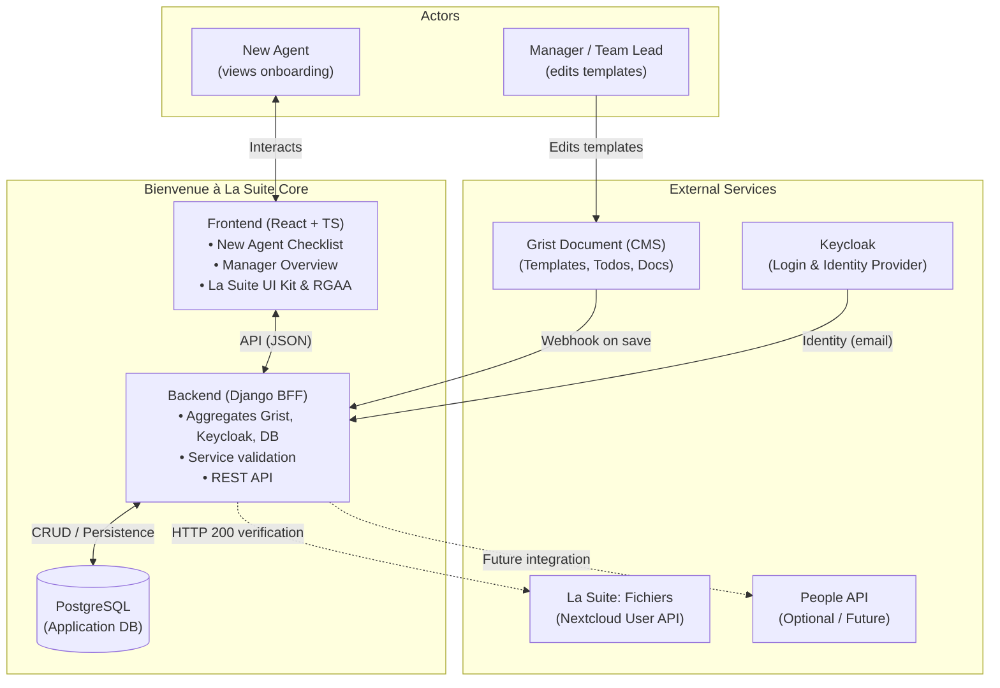

# System Architecture Overview

This document defines the high-level architecture for **Bienvenue à La Suite**, an onboarding mini-application designed for French public sector organizations using *La Suite Numérique*.

---

## 1. Context and Vision

Welcoming a new civil servant into an administration involves administrative setup (workstation, credentials, Wi-Fi) and onboarding onto sovereign digital tools (*La Suite Numérique*). 

This platform bridges management and newcomers:
- **Managers** configure onboarding templates, track team progress, and review milestones.
- **New Agents** navigate an accessible, step-by-step checklist, auto-verify their tool accounts (starting with **Fichiers**), discover colleagues on **Tchap**, access documentation, and validate their official email signature.

---

## 2. High-Level Architecture

The system operates as a **Backend-For-Frontend (BFF)** architecture connecting a no-code CMS (Grist), identity provider (Keycloak), relational persistence (PostgreSQL), and modern user interfaces (React).

---

## 3. Core Component Roles

| Component | Technology | Primary Responsibilities |
| :--- | :--- | :--- |
| **Frontend** | React, TypeScript, Vite, `@gouvfr-lasuite/ui-components` (La Suite UI Kit) | Renders the sequential onboarding wizard for new agents and the progress overview for managers. Enforces strict RGAA accessibility using the official La Suite design system. |
| **Backend (BFF)** | Django 6, Django REST Framework | Exposes REST endpoints, validates user existence in La Suite services, handles Grist webhooks, and orchestrates database transactions. |
| **Application DB** | PostgreSQL 16 | Relational persistence for agents, templates, todos, colleagues, documents, trainings, and agent completion statuses. |
| **CMS / Template Editor** | Grist | No-code collaborative workspace where managers customize checklists, links, videos, and signatures without developer intervention. |
| **Identity Provider** | Keycloak (OIDC) | Sovereign single sign-on issuing user identity (`email`, `name`, `roles`). Bypassed via a dev header during local testing. |
| **Service Validator** | La Suite (Fichiers) / Mock | Target service queried by Django to confirm that an agent's account exists (HTTP 200). |

---

## 4. Key Workflows

### 4.1 Template Authoring & Synchronization (Manager -> Grist -> Django)
1. The Manager updates onboarding tasks, documents, or colleagues inside the official Grist document.
2. On document save, Grist triggers an automated webhook (`POST /api/webhooks/grist/`) to the Django BFF.
3. Django calls the Grist REST API to fetch the full template bundle and atomically upserts records into PostgreSQL.

### 4.2 New Agent Onboarding & Sequential Unlocking
1. The New Agent opens the React Mini App and authenticates via Keycloak (or Dev Auth).
2. The frontend fetches the agent's assigned template and current task statuses (`GET /api/onboarding/me/`).
3. **Step 1 ("Init to La Suite - Fichiers")**:
   - The agent sees a **"Vérifier mon compte Fichiers"** button.
   - Clicking triggers `POST /api/todos/{id}/verify/`.
   - Django queries the Fichiers service. When HTTP 200 is received, the task is marked `done = true`.
   - The frontend automatically unlocks Step 2.
4. **Subsequent Steps (Manual / Honor System)**:
   - The agent works through La Suite discovery tasks and clicks **"Marquer comme fait"** (`POST /api/todos/{id}/toggle/`).
5. **Signature Step**:
   - The generated official email signature is displayed.
   - The agent confirms setup by clicking **"Valider ma signature"** (`POST /api/signature/accept/`).

### 4.3 Manager Monitoring
1. The Manager opens the Manager dashboard in React.
2. The frontend calls `GET /api/manager/overview/`.
3. Django computes real-time completion percentages, identifies blocked or pending steps, and allows reassignment of templates.

---

## 5. Architectural Invariants & Rules

1. **Email as Primary Identity**: The user's institutional email address (`email`) is the unique cross-system identifier linking Keycloak, Grist, Django, and La Suite services.
2. **Sequential Progression**: Step $N+1$ cannot be marked as completed until Step $N$ is resolved.
3. **Automated vs. Manual Steps**:
   - Critical identity/service steps (Fichiers) require server-side HTTP 200 verification.
   - Adoption and training tasks rely on self-declaration ("honor system").
4. **Data Integrity & Non-Destructive Sync**: Grist synchronization executes atomic upserts matched on `grist_row_id`. Child `todo_items` are updated in-place to guarantee that foreign key references in `agent_todo_statuses` are preserved and never erased by cascade deletions.
5. **Security Boundaries**: Webhooks require secret token verification (`GRIST_WEBHOOK_SECRET`). Development authentication bypass (`X-Dev-User-Email`) is strictly rejected and ignored in production (`DEBUG = False`).
6. **RGAA & La Suite Design Standards Compliance**: The frontend must conform to official La Suite design system standards (`@gouvfr-lasuite/ui-components`, `@gouvfr-lasuite/ui-tokens`) and RGAA 4.1 / WCAG 2.1 AA accessibility guidelines.
7. **Local Testability**: The core backend and database can boot and be fully exercised locally without external dependencies using `docker-compose.yml` and a built-in mock service.
