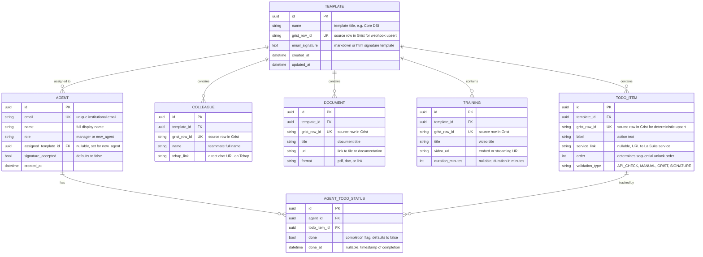

# Database Schema & Data Model Specifications

This document defines the relational PostgreSQL data model for **Bienvenue à La Suite**, matching the system ER diagram.

---

## 1. Entity-Relationship Diagram

---

## 2. Table Specifications

### 2.1 `templates`
Stores master onboarding templates synced from Grist.

| Column | Type | Constraints | Description |
| :--- | :--- | :--- | :--- |
| `id` | `UUID` | `PRIMARY KEY`, Default `gen_random_uuid()` | Unique template identifier. |
| `name` | `VARCHAR(255)` | `NOT NULL` | Descriptive name (e.g. *"Socle Commun Administration"*). |
| `grist_row_id` | `VARCHAR(128)` | `UNIQUE`, `NOT NULL` | Row ID in Grist for deterministic upsert synchronization. |
| `email_signature`| `TEXT` | `NOT NULL`, Default `''` | Template text for official email signatures. |
| `created_at` | `TIMESTAMPTZ` | `NOT NULL`, Default `NOW()` | Record creation timestamp. |
| `updated_at` | `TIMESTAMPTZ` | `NOT NULL`, Default `NOW()` | Last modification timestamp. |

### 2.2 `agents`
Represents civil servants (both managers and newcomers).

| Column | Type | Constraints | Description |
| :--- | :--- | :--- | :--- |
| `id` | `UUID` | `PRIMARY KEY`, Default `gen_random_uuid()` | Unique agent identifier. |
| `email` | `VARCHAR(255)` | `UNIQUE`, `NOT NULL` | Official email address; primary identity across all services. |
| `name` | `VARCHAR(255)` | `NOT NULL` | Full name of the agent. |
| `role` | `VARCHAR(32)` | `NOT NULL`, Check in `('manager', 'new_agent')` | Access control role. |
| `assigned_template_id` | `UUID` | `NULLABLE`, `REFERENCES templates(id) ON DELETE SET NULL` | The onboarding template assigned to this new agent. |
| `signature_accepted` | `BOOLEAN` | `NOT NULL`, Default `FALSE` | Flag indicating whether the agent confirmed signature setup. |
| `created_at` | `TIMESTAMPTZ` | `NOT NULL`, Default `NOW()` | Account initialization timestamp. |

### 2.3 `todo_items`
Checklist tasks defined inside a template.

| Column | Type | Constraints | Description |
| :--- | :--- | :--- | :--- |
| `id` | `UUID` | `PRIMARY KEY`, Default `gen_random_uuid()` | Unique task item identifier. |
| `template_id` | `UUID` | `NOT NULL`, `REFERENCES templates(id) ON DELETE CASCADE` | Parent template. |
| `grist_row_id` | `VARCHAR(128)` | `UNIQUE`, `NULLABLE` | Source row in Grist enabling in-place upsert without triggering cascade deletion on `agent_todo_statuses`. |
| `label` | `VARCHAR(512)` | `NOT NULL` | Actionable checklist prompt. |
| `service_link` | `TEXT` | `NULLABLE` | Deep-link to a relevant service (e.g. Fichiers, Tchap, Webmail). |
| `order` | `INTEGER` | `NOT NULL`, Default `0` | Sort key enforcing sequential task progression. |
| `validation_type` | `VARCHAR(32)` | `NOT NULL`, Check in `('API_CHECK', 'MANUAL', 'GRIST', 'SIGNATURE')` | Verification mechanism. |

### 2.4 `agent_todo_statuses`
Tracks individual agent progress against each assigned checklist item.

| Column | Type | Constraints | Description |
| :--- | :--- | :--- | :--- |
| `id` | `UUID` | `PRIMARY KEY`, Default `gen_random_uuid()` | Unique status record identifier. |
| `agent_id` | `UUID` | `NOT NULL`, `REFERENCES agents(id) ON DELETE CASCADE` | Associated agent. |
| `todo_item_id` | `UUID` | `NOT NULL`, `REFERENCES todo_items(id) ON DELETE CASCADE` | Associated task. |
| `done` | `BOOLEAN` | `NOT NULL`, Default `FALSE` | Completion status. |
| `done_at` | `TIMESTAMPTZ` | `NULLABLE` | Timestamp when the task was verified or marked done. |

> **Unique Constraint**: `UNIQUE(agent_id, todo_item_id)` ensures one status record per agent and task.

### 2.5 `colleagues`
Key team members and contacts relevant to the template.

| Column | Type | Constraints | Description |
| :--- | :--- | :--- | :--- |
| `id` | `UUID` | `PRIMARY KEY`, Default `gen_random_uuid()` | Unique colleague card identifier. |
| `template_id` | `UUID` | `NOT NULL`, `REFERENCES templates(id) ON DELETE CASCADE` | Associated template. |
| `grist_row_id` | `VARCHAR(128)` | `UNIQUE`, `NULLABLE` | Source row in Grist for in-place updates. |
| `name` | `VARCHAR(255)` | `NOT NULL` | Contact full name and position. |
| `tchap_link` | `TEXT` | `NOT NULL` | Deep-link to start a conversation in Tchap (`https://tchap.gouv.fr/#/user/...`). |

### 2.6 `documents`
Essential documentation, administrative guides, and intranet resources.

| Column | Type | Constraints | Description |
| :--- | :--- | :--- | :--- |
| `id` | `UUID` | `PRIMARY KEY`, Default `gen_random_uuid()` | Unique document identifier. |
| `template_id` | `UUID` | `NOT NULL`, `REFERENCES templates(id) ON DELETE CASCADE` | Associated template. |
| `grist_row_id` | `VARCHAR(128)` | `UNIQUE`, `NULLABLE` | Source row in Grist for in-place updates. |
| `title` | `VARCHAR(255)` | `NOT NULL` | Descriptive title. |
| `url` | `TEXT` | `NOT NULL` | Secure link to the document. |
| `format` | `VARCHAR(32)` | `NOT NULL`, Check in `('pdf', 'doc', 'link')` | Display badge format. |

### 2.7 `trainings`
Curated video tutorials and educational modules.

| Column | Type | Constraints | Description |
| :--- | :--- | :--- | :--- |
| `id` | `UUID` | `PRIMARY KEY`, Default `gen_random_uuid()` | Unique training record identifier. |
| `template_id` | `UUID` | `NOT NULL`, `REFERENCES templates(id) ON DELETE CASCADE` | Associated template. |
| `grist_row_id` | `VARCHAR(128)` | `UNIQUE`, `NULLABLE` | Source row in Grist for in-place updates. |
| `title` | `VARCHAR(255)` | `NOT NULL` | Video or tutorial title. |
| `video_url` | `TEXT` | `NOT NULL` | Video player or streaming link. |
| `duration_minutes` | `INTEGER` | `NULLABLE` | Duration in minutes for agent planning. |

---

## 3. Database Indexes

To optimize API latency, support high-frequency joins, and guarantee integrity:
- `CREATE UNIQUE INDEX idx_agents_email ON agents (LOWER(email));`
- `CREATE INDEX idx_agents_assigned_template ON agents (assigned_template_id);`
- `CREATE UNIQUE INDEX idx_templates_grist_row ON templates (grist_row_id);`
- `CREATE UNIQUE INDEX idx_todo_items_grist_row ON todo_items (grist_row_id);`
- `CREATE INDEX idx_todo_items_template_order ON todo_items (template_id, "order" ASC);`
- `CREATE UNIQUE INDEX idx_agent_todo_status ON agent_todo_statuses (agent_id, todo_item_id);`
- `CREATE INDEX idx_agent_todo_agent ON agent_todo_statuses (agent_id);`
- `CREATE INDEX idx_agent_todo_item ON agent_todo_statuses (todo_item_id);`
- `CREATE INDEX idx_colleagues_template ON colleagues (template_id);`
- `CREATE INDEX idx_documents_template ON documents (template_id);`
- `CREATE INDEX idx_trainings_template ON trainings (template_id);`

> **Data Integrity Rule**: When synchronizing updates from Grist, `grist_sync` must execute non-destructive upserts matched on `grist_row_id`. Deleting and re-inserting `todo_items` will trigger `CASCADE DELETE` on `agent_todo_statuses`, erasing newcomer checklist progress.
