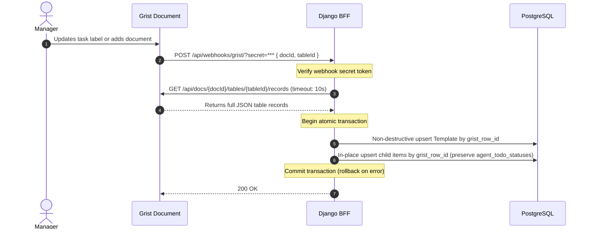

# External Integrations Guide

This document details how **Bienvenue à La Suite** interfaces with external services: **Grist**, **Keycloak**, and **La Suite: Fichiers**.

---

## 1. Grist (No-Code CMS & Webhooks)

Grist serves as the collaborative editor where managers maintain templates without touching code or database migrations.

### 1.1 Grist Document Structure

The master Grist document contains 5 coordinated tables:

1. **`Templates`**:
   - `Name` (Text)
   - `EmailSignature` (Text)
2. **`TodoItems`**:
   - `Template` (Reference to `Templates`)
   - `Label` (Text)
   - `ServiceLink` (Text)
   - `Order` (Integer)
   - `ValidationType` (Choice: `API_CHECK`, `MANUAL`, `GRIST`, `SIGNATURE`)
3. **`Colleagues`**:
   - `Template` (Reference to `Templates`)
   - `Name` (Text)
   - `TchapLink` (Text)
4. **`Documents`**:
   - `Template` (Reference to `Templates`)
   - `Title` (Text)
   - `URL` (Text)
   - `Format` (Choice: `pdf`, `doc`, `link`)
5. **`Trainings`**:
   - `Template` (Reference to `Templates`)
   - `Title` (Text)
   - `VideoURL` (Text)
   - `DurationMinutes` (Integer)

### 1.2 Webhook Configuration in Grist

In Grist (*Document Settings -> Webhooks*):
- **Target URL**: `http://backend:8000/api/webhooks/grist/?secret=<GRIST_WEBHOOK_SECRET>` (or header `X-Grist-Webhook-Token: <GRIST_WEBHOOK_SECRET>`).
- **Trigger**: On row update, creation, or deletion.
- **Payload**: Standard Grist JSON notification containing `docId` and affected `tableId`.
- **Security**: The Django BFF strictly validates the incoming secret against the server-side environment variable `GRIST_WEBHOOK_SECRET`. Calls missing or failing secret verification are rejected immediately with `401 Unauthorized`.

### 1.3 Django Ingestion Flow (`grist_sync.py`)



- **Idempotency & Data Integrity**: Child records (`todo_items`, `colleagues`, `documents`, `trainings`) are matched and updated by their unique `grist_row_id`. Existing `todo_item.id` primary keys are preserved to ensure foreign key references in `agent_todo_statuses` remain intact.

---

## 2. Keycloak (Sovereign OIDC Identity)

Keycloak provides central single sign-on across the ministerial suite.

### 2.1 Configuration
- **Realm**: `lasuite`
- **Client ID**: `bienvenue-app`
- **Access Type**: Public (PKCE for React frontend) or Confidential (for Django token introspection).
- **Required Claims**:
  - `email`: Institutional email address (e.g. `agent@gouv.fr`).
  - `name`: Display full name.
  - `resource_access`: Roles array containing `manager` or `new_agent`.

### 2.2 Local Testing Dev Auth Bypass
When running locally with `DEBUG = True`:
- The frontend or developer can specify the header:
  `X-Dev-User-Email: alex.martin@gouv.fr`
- Django authenticates the request as `alex.martin@gouv.fr` directly. If the agent does not exist in Postgres, Django initializes an agent record automatically for smooth local DX.
- **Production Guardrail**: In production (`DEBUG = False`), `X-Dev-User-Email` is unconditionally ignored. All requests must present a valid Keycloak JWT Bearer token.

---

## 3. La Suite: Fichiers (Nextcloud User API)

In Step 1 of onboarding ("Init to La Suite"), the platform verifies that the agent's account has been successfully provisioned on the **Fichiers** storage service.

### 3.1 Verification Endpoint Contract

Django queries the Fichiers Provisioning API via HTTP GET:
```http
GET /ocs/v1.php/cloud/users/{encoded_email}
Host: fichiers.numerique.gouv.fr
OCS-APIREQUEST: true
Authorization: Bearer <ADMIN_SERVICE_TOKEN>
Accept: application/json
```

- **Parameter Encoding**: `{encoded_email}` must be URL-encoded using `urllib.parse.quote(email, safe='')` to safely handle symbols (`@`, `.`, `+`) and prevent path injection.
- **HTTP 200 OK**: The user exists and their cloud storage quota is initialized.
- **HTTP 404 Not Found**: The account has not yet been provisioned.

### 3.2 Service Verifier Implementation Details (`suite_verifier.py`)
- **Timeout**: Strict 5.0 seconds timeout to prevent blocking worker threads.
- **Error Handling**: Graceful fallback returning `{ "exists": false, "error": "Service temporarily unreachable" }` if network or SSL errors occur.
- **Local Mock Support**: When `LA_SUITE_FICHIERS_URL` is set to `http://backend:8000/api/mock-suite/fichiers/users/{email}`, requests route to Django's built-in mock endpoint for fully isolated local testing.
