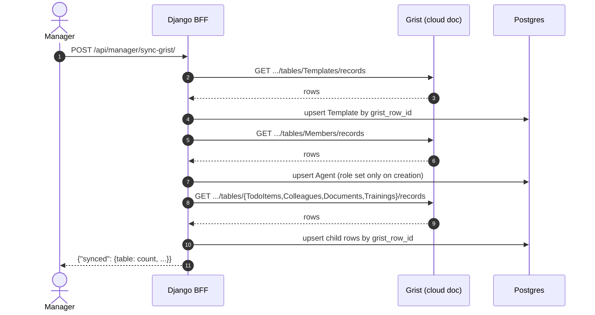

# External Integrations Guide

This document details how **Bienvenue à La Suite** interfaces with external services: **Grist**, **Keycloak**, and **La Suite: Fichiers**.

---

## 1. Grist (No-Code CMS, pull-based sync)

Grist serves as the collaborative editor where HR and managers maintain onboarding content without touching code or database migrations. The team-shared doc lives on the Grist cloud (`docs.getgrist.com`); a self-hosted Grist instance (see `docker-compose.yml`) exists only as an offline/dev fallback and local snapshot target, not the primary source.

There is no webhook. Sync is a manager-triggered pull: the app never listens for Grist to call it, it goes and fetches on demand.

### 1.1 Grist Document Structure

The Grist document contains 6 coordinated tables:

1. **`Templates`**:
   - `Name` (Text)
   - `EmailSignature` (Text)
2. **`Members`** — HR-maintained roster of new agents, one row per person:
   - `Email` (Text) — matched case-insensitively against `Agent.email`
   - `Name` (Text)
   - `Template` (Reference to `Templates`) — chosen by a manager, resolves `Agent.assigned_template`
3. **`TodoItems`**:
   - `Template` (Reference to `Templates`)
   - `Label` (Text)
   - `Description` (Text, optional)
   - `ServiceLink` (Text)
   - `DocUrl` (Text, optional)
   - `Order` (Integer)
   - `ValidationType` (Choice: `API_CHECK`, `MANUAL`, `GRIST`, `SIGNATURE`)
4. **`Colleagues`**:
   - `Template` (Reference to `Templates`)
   - `Name` (Text)
   - `TchapLink` (Text)
5. **`Documents`**:
   - `Template` (Reference to `Templates`)
   - `Title` (Text)
   - `URL` (Text) — cloud doc uses `URL`, the self-hosted doc uses `Url`; `grist_sync.py` accepts either
   - `Format` (Choice: `pdf`, `doc`, `link`)
6. **`Trainings`**:
   - `Template` (Reference to `Templates`)
   - `Title` (Text)
   - `VideoURL` (Text) — same casing note as `Documents.URL`
   - `DurationMinutes` (Integer)

### 1.2 Triggering a sync

`POST /api/manager/sync-grist/` (requires the `IsManager` permission) pulls every table above via the Grist REST API and upserts Postgres. There's no dedicated UI button for this yet — call the endpoint directly (curl, or `docker compose exec backend python manage.py sync_grist` for a CLI equivalent) until the frontend wires one up.

### 1.3 Django Ingestion Flow (`grist_sync.py`)



- **Order matters**: `Templates` is synced first so child tables (including `Members`) can resolve their `Template` ref via `Template.grist_row_id`. A child row whose `Template` ref doesn't resolve is skipped and logged, not errored.
- **Idempotency & data integrity**: every synced model carries a unique `grist_row_id`; `update_or_create` means existing primary keys are preserved across re-syncs, so `agent_todo_statuses` foreign keys never dangle.
- **Members provisioning**: `sync_members()` sets `Agent.role` only when creating a brand-new agent — it never downgrades an existing agent's role (e.g. a manager mistakenly added to `Members`). This lets HR pre-provision a new agent's `assigned_template` before their first login, replacing an earlier arbitrary "first template found" fallback.
- **Local backup**: `python manage.py mirror_grist_to_selfhosted` copies the cloud doc's content into the self-hosted Grist doc wholesale (wipe + recreate), remapping `Template` refs since row ids differ between the two docs. Intended as an occasional snapshot, not a live sync — don't treat the self-hosted copy as a second place to edit content, the next mirror run will overwrite it.

---

## 2. Keycloak (Local OIDC Identity)

A Keycloak instance dedicated to this project (see `docker-compose.yml` and `docker/keycloak/realm.json`) provides SSO, standing in for ProConnect.

### 2.1 Configuration
- **Realm**: `bienvenue-lasuite`
- **Client ID**: `bienvenue-lasuite`
- **Demo accounts**: `agent` / `agent` (`agent@bienvenue.local`) and `manager` / `manager` (`manager@bienvenue.local`), defined in `docker/keycloak/realm.json`.
- **Claims Django relies on**: `email` and `name` only. Keycloak does **not** carry the manager/new_agent role — that lives on `Agent.role` in Postgres. A Keycloak-authenticated identity with no matching `Agent` yet is auto-provisioned as `new_agent` with no assigned template (see §1.3, Members provisioning).

### 2.2 Local Testing Dev Auth Bypass
When running locally with `DEBUG = True`:
- The frontend or developer can specify the header:
  `X-Dev-User-Email: alex.martin@gouv.fr`
- Django authenticates the request as `alex.martin@gouv.fr` directly. If the agent does not exist in Postgres, Django initializes an agent record automatically for smooth local DX.
- **Production Guardrail**: In production (`DEBUG = False`), `X-Dev-User-Email` is unconditionally ignored. All requests must present a valid Keycloak session or Bearer token.

---

## 3. La Suite: Fichiers (Nextcloud User API)

In Step 1 of onboarding ("Init to La Suite"), the platform verifies that the agent's account has been successfully provisioned on the **Fichiers** storage service.

### 3.1 Verification Endpoint Contract

Django queries the Fichiers Provisioning API via HTTP GET:
```http
GET /ocs/v1.php/cloud/users/{encoded_email}
Host: fichiers.numerique.gouv.fr
OCS-APIREQUEST: true
Authorization: Bearer <ADMIN_SERVICE_TOKEN>
Accept: application/json
```

- **Parameter Encoding**: `{encoded_email}` must be URL-encoded using `urllib.parse.quote(email, safe='')` to safely handle symbols (`@`, `.`, `+`) and prevent path injection.
- **HTTP 200 OK**: The user exists and their cloud storage quota is initialized.
- **HTTP 404 Not Found**: The account has not yet been provisioned.

### 3.2 Service Verifier Implementation Details (`suite_verifier.py`)
- **Timeout**: Strict 5.0 seconds timeout to prevent blocking worker threads.
- **Error Handling**: Graceful fallback returning `{ "exists": false, "error": "Service temporarily unreachable" }` if network or SSL errors occur.
- **Local Mock Support**: When `LA_SUITE_FICHIERS_URL` is set to `http://backend:8000/api/mock-suite/fichiers/users/{email}`, requests route to Django's built-in mock endpoint for fully isolated local testing.
